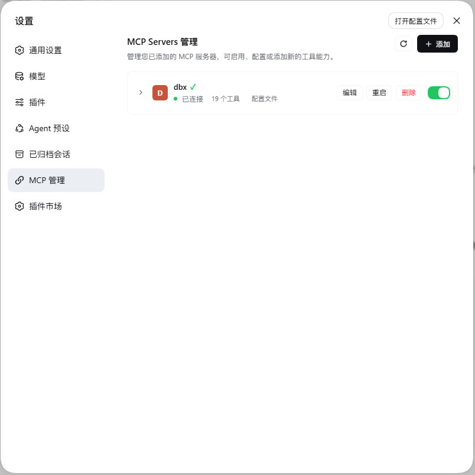
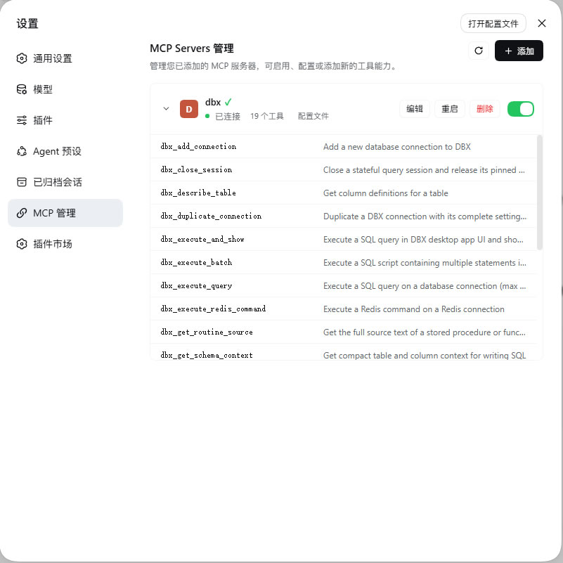
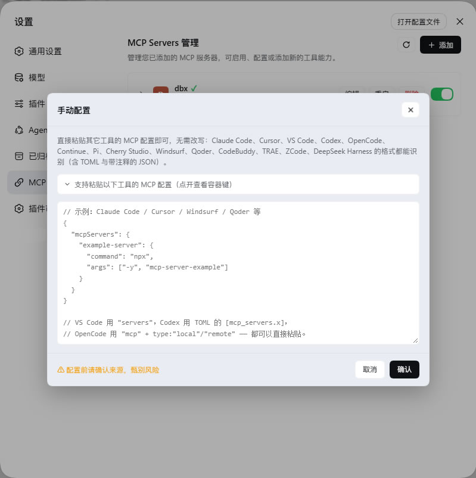
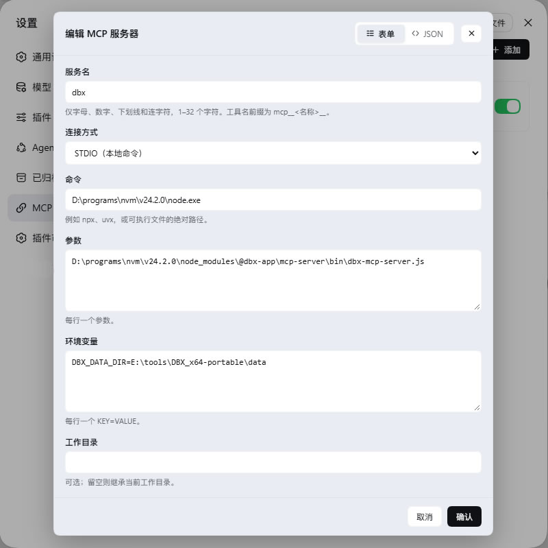
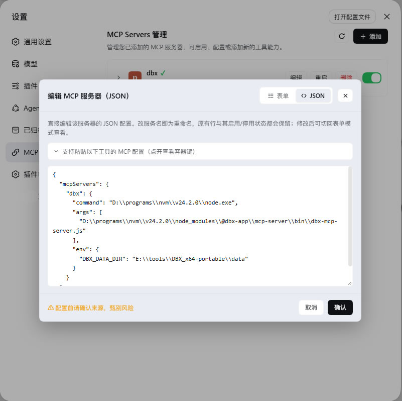

# dsh-mcp-manager-plus

English | [中文](README.md) | [Changelog](CHANGELOG.md)

An MCP server manager plugin for DeepSeek Harness: it adds an "MCP" page to the
settings sidebar, where you can inspect, enable/disable, edit, restart, delete
and add MCP servers.

Why this plugin exists:

- To manage MCP servers in DeepSeek Harness without ever opening a config file.
- Most MCP-related plugins on the plugin market target older DSH releases and
  simply do not work on current ones, so I had to write my own.

If this plugin stops working on a newer DSH release, please open an issue.

## Screenshots

**Settings → MCP**: the server list, connection state and enable/disable toggles.



**Expand a server**: every tool the server currently registers with the model,
with descriptions.



**Add**: paste an MCP configuration from any tool — the format is detected
automatically (Codex's TOML and JSON-with-comments included).



**Edit · form mode**: edit field by field; switch to JSON mode at any time from
the dialog header.



**Edit · JSON mode**: opens pre-filled with the server's current configuration;
paste a whole replacement block, and renaming is just changing the name.



## Installation

**Requirements:** DSH >= 0.1.5-rc.1 (developed and tested on 0.1.6-alpha.1).
DSH itself needs Node.js >= 24.2.0 and Git >= 2.31.0.

### Option 1: one-click install from the plugin market

If you have [dshmarket](https://github.com/dsh-market/dsh-market) installed,
open **Settings → Plugin market**, search for `dsh-mcp-manager-plus`, and click
install.

### Option 2: command line

Pick any one of the three sources (`--profile web` installs into the `web`
profile; substitute your own profile name as needed):

```sh
# npm package (available once published)
dsh plugin --profile web add dsh-mcp-manager-plus

# GitHub repository
dsh plugin --profile web add https://github.com/appthin/dsh-mcp-manager-plus.git

# Local directory (clone this repository first; installed as a link, so edits
# take effect immediately — handy for development)
dsh plugin --profile web add <the cloned repository directory>
```

Restart dsh (or wait for the profile hot-reload); the page appears under
**Settings → MCP**.

### Verify

Open dsh web and go to **Settings → MCP** (the chain-link icon in the sidebar).
If the page does not show up, check in this order:

1. Switch to the latest Chrome/Edge — plugin bundles can fail to load on
   Chromium kernels older than 122;
2. Confirm it is installed into the profile you are actually running
   (`dsh plugin --profile web ls` lists the profile contents);
3. If the browser console shows errors, [open an issue](../../issues/new) with
   the message attached.

### Update & uninstall

```sh
dsh plugin --profile web ls                          # list installed plugins
dsh plugin --profile web add dsh-mcp-manager-plus    # update (re-adding installs the latest)
dsh plugin --profile web remove dsh-mcp-manager-plus # uninstall
```

With the plugin market installed, updates can also be done with one click on
its page. Uninstalling keeps the MCP server rows this plugin wrote into the
profile patch layer — that is your configuration data and will not be deleted.

## Features

| Capability | Description |
| --- | --- |
| List | Shows the MCP servers from the config file |
| Expand | Open a row to see every tool the server registers with the model, with descriptions |
| Enable / disable | Writes a `disabled` override into the patch layer; takes effect hot in ~1 s, no dsh restart |
| Edit | Two switchable modes: **form** (field by field) or **JSON** (one large textarea), see below |
| Restart | Destroys and re-initializes the server's connection in place (config unchanged); for recovering from dropped connections |
| Delete | Removes the server and all of its override rows from the config file |
| Add | Paste an MCP configuration from **any mainstream tool**; the format is detected, and multiple servers per paste are supported (see table below) |
| Bilingual | Chinese / English. Defaults to the harness UI language (falling back to the browser's language when unavailable); switch anytime from the page header — the choice is remembered, and host-side messages follow along |

## The two edit modes

When editing an existing server, the dialog header carries a **segmented
switch** (with icons and a sliding indicator, `radiogroup` semantics, arrow-key
navigable) to flip between modes at any time:

- **Form mode**: edit field by field (server name, transport, command, args,
  env, cwd, URL, headers).
- **JSON mode**: one large textarea that **opens pre-filled with the server's
  current configuration** (not an empty box or an example), so you can paste a
  whole replacement block — especially handy for configs copied from elsewhere.
  A collapsible format guide above the box lists the supported tools and their
  container keys, shared with the "Add" dialog.

Both modes write to the same row, therefore:

- **Renaming in JSON mode renames the row**: it keeps the original `id` and its
  enable/disable overrides instead of creating a duplicate;
- JSON mode supports every import format (Codex's TOML included), since format
  parsing is independent of add-vs-edit;
- A paste containing **multiple** servers is rejected with their names listed,
  avoiding the "which one actually got saved?" ambiguity;
- Switching back to form mode reads the row from disk, so half-edited JSON
  never leaks across modes.

> JSON mode exists only for **existing** servers: saving JSON means "update the
> named row", which needs a row name. New servers go through "Add", which is
> already JSON mode.

The container-key table in the format guide (`FORMAT_ROWS`) must agree with the
parser or the guide would lie — a test in `test/client.test.mjs` cross-checks
both: every key in the table must actually parse, and all 14 tool names the
parser supports must appear in the table.

## Supported import formats

Paste as-is; the plugin recognizes container keys, field names and file syntax:

| Tool | Container key | stdio | Remote | Notes |
| --- | --- | --- | --- | --- |
| Claude Code · Cursor · Windsurf · Qoder · Cherry Studio · CodeBuddy · TRAE · ZCode | `mcpServers` | `command`/`args` | `url`/`headers` | the standard format |
| DeepSeek Harness (this plugin itself) | `mcpServers` | `command`/`args` | `url`/`headers` | native format |
| VS Code | **`servers`** | `command`/`args` | `type:"http"` + `url` | different outer key |
| Codex | `mcp_servers` | `command`/`args` | `url` | **TOML**, not JSON |
| OpenCode | `mcp` | `type:"local"`, **command is an array** | `type:"remote"` + `url` | most divergent shape |
| Continue | `mcpServers` **array** | `command`/`args` | — | name lives inside each entry |
| Pi | `mcpServers` + `settings` | `command`/`args` | `transport:"streamable-http"` | `settings` is ignored |

These variations are also handled:

- **TOML input**: Codex's `config.toml` can be pasted directly (including
  nested `[…​.env]` tables and inline comments).
- **JSON comments and trailing commas**: docs for several tools carry `//`,
  `/* */` and trailing commas — all parse fine.
- **`type:"sse"`** maps onto this plugin's streamable-http transport.
- **`serverUrl`** (Windsurf's remote spelling), **`http_headers`** (Codex) and
  **command arrays** (OpenCode) are all filed correctly.
- **Unknown fields** such as `enabled`, `lifecycle` or `description` never fail
  an import; they are just not written to the config.

The import reports the detected source, e.g. `已识别 Codex 配置；新增 xxx`
("Codex configuration detected; added xxx"). A single failing entry is skipped
and listed with its reason, so one bad block does not waste the whole paste.

## Where the config lives

The plugin's single source of truth is the current profile's user patch layer:

```
$DSH_HOME/profiles/<profile>/cordis.patch.yml
```

Adding an MCP server appends one loader patch entry to that file:

```yaml
- insert:
    - id: mcp-github
      name: '@deepseek-ai/dsh-mcp-client'
      config:
        serverName: github
        transport: stdio
        command: npx
        args: ["-y", "@modelcontextprotocol/server-github"]
        env:
          GITHUB_TOKEN: "…"
```

Disabling writes a sibling override row instead:

```yaml
- id: mcp-github
  disabled: true
```

Because the profile runs with `patchReload: live`, the loader re-orchestrates
the plugin tree within about a second of each save, so config changes are both
**persistent and hot-effective** — the plugin never mutates the running loader
tree; it only writes the file, then the browser briefly polls to observe the
converged state.

## Security model

- **Loopback only.** The API lives on the same loopback web server; non-loopback
  origins get a 403.
- **Validate before writing.** Every candidate file is re-parsed as a
  top-level loader patch array; a parse failure refuses the write, so one bad
  edit cannot break the next boot.
- **Nothing outside its jurisdiction.** The file is hand-written by users:
  comments, unrelated entries and unknown fields survive a rewrite untouched —
  only the one modified block is rewritten.
- **Secrets stay local.** Values whose keys look like
  `KEY|PASSWORD|SECRET|TOKEN` are masked on read, and unmasked again when the
  browser echoes them back; real secrets never appear on the page.
- **Bundle-provided servers are read-only.** Rows contributed by the bundle
  layer can be enabled/disabled but not edited or deleted.

## Development

```sh
node test/run.mjs          # all seven suites (106 assertions)
```

| Suite | Coverage |
| --- | --- |
| `test/patch.test.mjs` | patch-layer segmentation, parsing, validation, generation and byte-exact round-trips |
| `test/import.test.mjs` | config formats of 14 tools, the TOML subset, JSON comments and trailing commas |
| `test/editjson.test.mjs` | JSON-mode editing: in-place updates, renames keeping id and overrides, multi-server rejection |
| `test/host.test.mjs` | every host-side HTTP route, driving the real `apply()` through a fake Cordis context |
| `test/client.test.mjs` | whether the shell can load the browser bundle and register the settings page, mode switch included |
| `test/compose.test.mjs` | composing a real profile from the bundle layer, confirming this plugin's rows mount |
| `test/live.test.mjs` | read-only run against the real profile, confirming live configs read correctly with secrets masked |

The tests use no test framework — just Node's built-in `node:test` — and reuse
the `js-yaml` from the profile (the same parse path as the runtime).

### Layout

| File | Purpose |
| --- | --- |
| `lib/index.js` | host side: HTTP API, inventory projection, write operations |
| `lib/import.js` | import parsing: each tool's config format → this plugin's server shape |
| `lib/patch.js` | patch-layer read/write: segmentation, parsing, validation, generation |
| `lib/client.js` | browser side: the settings page UI (hand-written lazy-CJS bundle, no build step) |
| `cordis.patch.yml` | the bundle patch inserting this plugin into the profile's layer stack |

### Helper scripts

| Script | Purpose |
| --- | --- |
| `node tools/e2e-import.mjs` | boots a real host and POSTs each of the 14 tool formats to `/import`, then validates the written patch rows |
| `node tools/roundtrip-json.mjs` | verifies the JSON editor's pre-filled config round-trips byte-for-byte (confirming unchanged content drops no fields) |
| `node tools/check-client-bundle.mjs` | loads the client bundle the way the shell does and checks the registration result and nav-icon CSS |
| `node tools/check-segmented.mjs` | checks the segmented switch's slider geometry (inset, half-width, offset) against the track assumptions |
| `node tools/preview-edit-modes.mjs` | renders both edit-dialog modes with the real components into `edit-modes-preview.html` |
| `node tools/check-nav-icon.mjs` | checks that the nav icon's mask payload is a drawable 16×16 template |
| `node tools/gen-icon-preview.cjs` | extracts icons from the dsh web bundle into the `icon-options.html` comparison page |
| `node tools/dump-icon.cjs <IconName>` | prints an icon's SVG path for hand-written overrides |

## License

MIT
